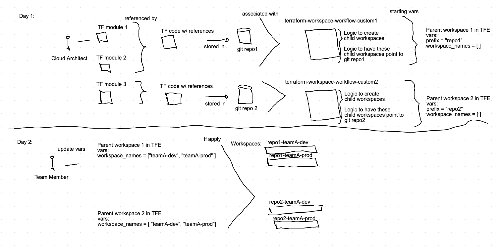
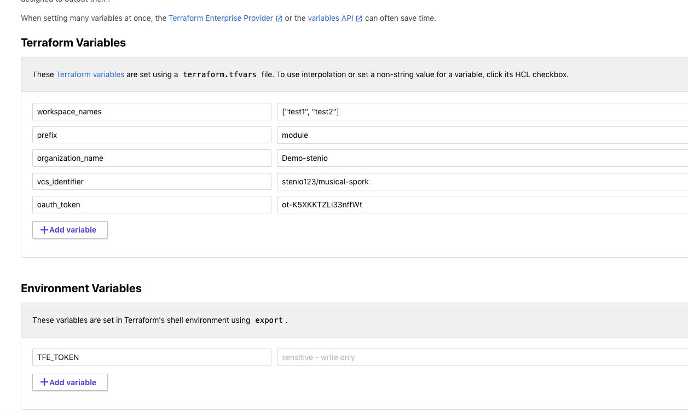
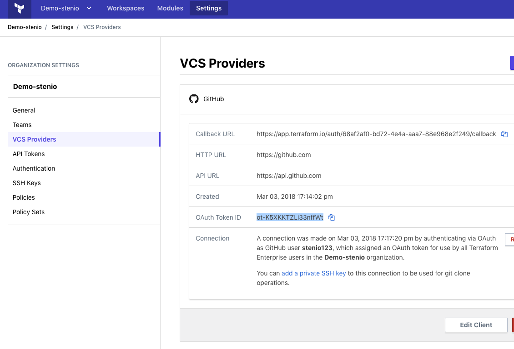
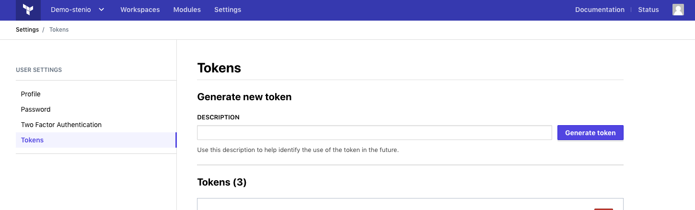

# Terraform Parent Workspace Workflow Demo

This is an example of how to use a parent TFE workspace to coordinate creation of child workspaces. 

Workflow suggestions:
- You can have child workspaces pointing to modules, therefore you can have a collection of parent workspaces serving as a "catalog" of available deployments
- A team requesting a new deployment of a catalog item just needs to add their name in the list of workspaces
- Commented in the code is an example of how to retrieve sensitive variables from an existing Vault server

## Setup

1. Fork this repository
2. Associate to a workspace in TFE
3. Create the following variables.

Note: since "workspace_names" is a list, make sure you select type "hcl" when creating this variable

The variable "oauth_token" is not sensitive because it is only the id of your VCS connection token as stored in TFE.
To get it:

To create a TFE_TOKEN with your user's permissions:

4. Execute apply
5. When you want to add new workspaces, just update the variable "workspace_names"

## Known Limitations
- The current iteration of this code does not consider lifecycle questions for the child workspaces
- Suggestions on how address this include using [TF lifecycle hooks](https://www.terraform.io/docs/configuration/resources.html#lifecycle-lifecycle-customizations) or use some type of [reaper associated with TTL variable values](https://github.com/AdamCavaliere/TFE_WorkspaceReaper) 